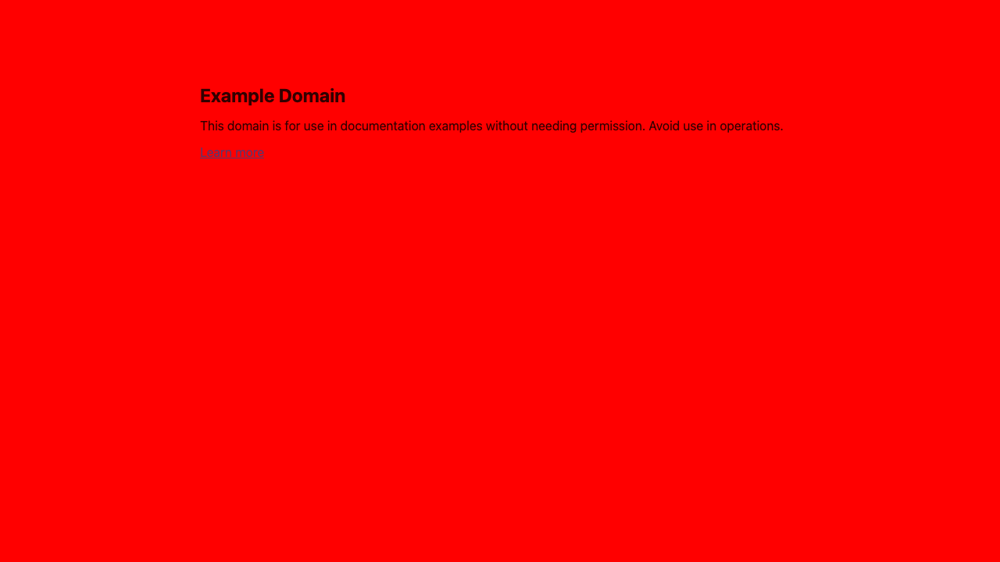

# 🧠 Vision Bug Detector
**AI-Powered UI Regression Detection System**

## 🚀 Overview

Vision Bug Detector is an AI-powered system that automatically detects and explains visual bugs in UI or game screens by comparing screenshots.

It combines:
- 📸 Automated screenshot capture
- 🧮 Computer vision (OpenCV + SSIM)
- 🤖 AI reasoning (LLaVA via Ollama)

## ❓ Problem Statement

Manual UI testing is:
- ⏱ Time-consuming
- ❌ Error-prone
- 📉 Not scalable

Small visual bugs like:
- Misaligned buttons
- Missing UI elements
- Color or layout changes

…are often missed by human testers.

## 💡 Solution

This system automates UI regression testing using a 3-stage pipeline:

**Capture → Detect → Explain**

### 🔹 1. Capture
- Uses Playwright to capture:
- Baseline (expected UI)
- Current (new UI)

### 🔹 2. Detect (Computer Vision)
- Pixel-level diff (OpenCV)
- Structural similarity (SSIM)
- Morphological filtering
- Region detection (bounding boxes)

### 🔹 3. Explain (AI)
- Uses LLaVA (via Ollama)
- Generates human-readable bug descriptions
- Outputs structured JSON reports

## 🧩 System Architecture
```
Playwright (Screenshots) 
            ↓ 
Diff Engine (OpenCV + SSIM) 
            ↓ 
AI Analyzer (LLaVA / Ollama) 
            ↓ 
Bug Report (JSON + Visualization)
```

## 📸 Example Output

### 🖼 Baseline vs Current
**Baseline** | **Current**
--- | ---
 | 

### 🔍 Diff Detection
- `diff.png` → raw pixel differences
- `highlighted.png` → detected bug regions

### 🤖 AI Output
```json
{
  "summary": "Background color changed",
  "confidence": 0.92,
  "needs_human_review": false,
  "findings": [
    {
      "title": "Background color change",
      "severity": "medium",
      "category": "styling",
      "evidence": "Background turned red"
    }
  ]
}
```

## 📁 Project Structure
```
vision-bug-detector/
│
├── data/screenshots/ # Test cases (baseline & current)
├── scripts/
│ └── capture.py # Screenshot automation
│
├── src/
│ ├── diff_engine.py # CV-based detection
│ └── ai_analyzer.py # AI-based explanation
│
├── test_ai.py # End-to-end pipeline runner
├── requirements.txt
└── README.md
```

## ⚙️ Setup

```bash
python3 -m venv .venv
source .venv/bin/activate
pip install -r requirements.txt
python -m playwright install chromium
```

### 🤖 Setup AI (Ollama)
```bash
ollama pull llava
ollama run llava
```

## ▶️ Run Project

### 1️⃣ Capture Screenshots
```bash
python scripts/capture.py
```

### 2️⃣ Run Diff Engine
```bash
python src/diff_engine.py
```

### 3️⃣ Run AI Analysis
```bash
python test_ai.py
```

The AI step writes `report.json` to `data/screenshots/login_test/report.json`.

## 🧠 Tech Stack
- Python
- Playwright
- OpenCV
- scikit-image (SSIM)
- Ollama
- LLaVA (Vision LLM)

## 🔥 Key Features
- ✅ Automated UI screenshot capture
- ✅ Pixel + structural diff detection
- ✅ Noise reduction using morphology
- ✅ Region-based bug localization
- ✅ AI-generated bug explanations
- ✅ Structured JSON output

## 📈 Current Status
- ✅ Screenshot pipeline
- ✅ Diff engine (OpenCV + SSIM)
- ✅ AI analyzer (LLaVA integration)

## 🔜 Future Improvements
- Dashboard (Streamlit)
- CI/CD integration
- Region-based image cropping for better AI accuracy
- Severity scoring system
- Web dashboard (Streamlit / React)
- CI/CD integration (GitHub Actions)
- Video-based bug detection

## 💼 Why This Project Matters

This project demonstrates:
- Real-world AI system design
- Computer Vision + LLM integration
- Production-level code structure
- Practical QA automation use case

---
